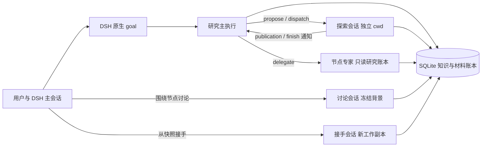

# Research 插件 0.6.0 设计与功能说明

## 用户模型

Research 是 DSH 内的项目工作台。初始化会话是研究主会话；Agent 可以创建独立 cwd 的探索会话，也可以在一个节点内按需委派共享 cwd 的短期专家。用户可为任意节点打开独立讨论，或从历史文件快照创建人工接手会话。所有模型请求与工具动作仍在 DSH 原生轨迹中。

项目控制意图、原生 goal phase、原生 turn、作业、暂停原因和工作段分别保存与展示。`open` 工作段不等于正在运行；goal 完成不自动发布、关闭节点或宣称研究成功。

## 研究图与执行

每个节点由固定版本 `open_question` 驱动，没有强制阶段数或固定角色数。负责人按实际缺口决定单 Agent 工作、并行节点探索或临时专家。默认最多两个主/探索研究会话并行；每个节点最多两个活动或退出未知的专家。父会话等待本地专家时仍占研究槽位，专家不占该槽。

探索会话获得具体问题、计划、固定输入、独立目录和回传要求。发布和结束产生持久通知；仅等待子任务且项目仍允许运行的 goal 可被唤醒。人工暂停、原生 Stop、故障、项目暂停、目标完成和冷恢复不会被迟到通知解除。

专家任务固定问题、目的、输入、工具范围、产物、完成标准和回传格式。子 session 在首个 assemble 前核对 `parentSession` 并登记。专家只能查询研究记录；所有研究写工具和递归委派由服务端拒绝。模型错误返回 incomplete，父取消传递原生 signal，无法确认退出时返回 unverified。

## 记忆与检索

完整轨迹、笔记、不可变发布和知识修订永久保留。模型自动获得的是按本次身份与任务组装的稳定内容包：核心约定、任务与固定输入、节点检查点、相关知识/条件/分歧、早期负结果、近期细节和展开入口。用量、时钟和请求 ID 只进入外部清单。

知识条目保存 kind、statement、scope、conditions、status、evidence、source identity、dependencies、supersedes、author 和 revision。观察、claim 与 lesson 必须声明证据；假设与未决问题可以没有实验，但必须有提出来源。修订追加版本并检查 expected_revision。

检索以固定引用优先，文本查询对中文使用有序 bigram，对英文、数字和版本号保留术语项。历史集合与用量使用 keyset 分页；一次遍历可固定 upper_id。大字段先返回 8 KiB 预览，再以 base64 JSON 分块展开，因此账本增长不会让控制查询触及 IPC 上限。

## 文件、恢复和迁移

发布先固定文件对象再提交元数据；重复业务键返回原结果。快照排除 `.research`、Git 元数据和疑似凭据。接手预览不写文件、不创建会话、不调用模型；确认后恢复到新目录并创建无 goal 的 handoff 会话。

schema 4 从 schema 3 事务迁移，并先保存一致性数据库备份。旧节点生成带 legacy 来源的议程锚；无法证明的关联和用量保持未知。Markdown 记忆文件是只读投影，摘要不匹配的外部改动先保存到 drafts，再按数据库重建。

## 边界

- 没有供应商级费用硬封顶；只展示实际、估算、进行中、缺失与讨论用量。
- 没有独立 Python 模型运行时、定时总结服务或备用执行器。
- 讨论和接手不自动影响自主方向；整理专家只返回提案，由负责人提交知识修订。
- DSH 权限决定目录读取能力，独立 cwd 只提供工作副本与归属，不提供安全隔离承诺。
- 程序校验身份、状态、引用、并发和事务，不裁判科学真假。
